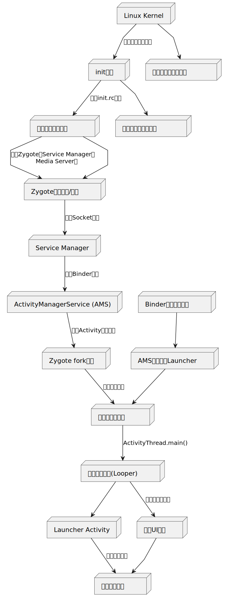

以下是Android系统从Linux内核启动到Launcher启动的完整流程图及关键步骤说明：

---

### **Android系统启动流程图**

```plaintext
+---------------------+     +---------------------+     +---------------------+
|    Linux Kernel     | --> |      init进程        | --> |  启动关键系统服务    |
+---------------------+     +---------------------+     +---------------------+
       |                          |                                |
       | 初始化硬件、驱动          | 解析init.rc配置                | 启动Zygote、Service Manager、
       v                          v                                v Media Server等
+---------------------+     +---------------------+     +---------------------+
|  内核空间初始化完成  |     |  用户空间第一个进程  |     | Zygote预加载类/资源  |
+---------------------+     +---------------------+     +---------------------+
                                                                 |
                                                                 | 监听Socket请求
                                                                 v
+---------------------+     +---------------------+     +---------------------+
|  Service Manager    | --> | ActivityManagerService (AMS) | --> | Zygote fork进程 |
+---------------------+     +---------------------+     +---------------------+
       |                          |                                |
       | 注册Binder服务            | 管理Activity生命周期           | 创建应用进程
       v                          v                                v
+---------------------+     +---------------------+     +---------------------+
| Binder通信框架就绪   |     | AMS请求启动Launcher | --> | 应用进程初始化        |
+---------------------+     +---------------------+     +---------------------+
                                                                 |
                                                                 | ActivityThread.main()
                                                                 v
+---------------------+     +---------------------+
| 主线程初始化(Looper) | --> | Launcher Activity   |
+---------------------+     +---------------------+
       |                          |
       | 加载布局、渲染            | 显示桌面图标
       v                          v
+---------------------+     +---------------------+
|  完成UI绘制         | --> | 用户交互就绪        |
+---------------------+     +---------------------+
```

---

### **关键步骤详解**

#### **1. Linux内核启动**
- **硬件初始化**：加载硬件驱动（CPU、内存、I/O设备等）。
- **挂载根文件系统**：建立系统目录结构（如`/system`、`/data`）。
- **启动第一个用户进程**：内核启动后调用`init`进程（PID=1）。

#### **2. init进程**
- **解析`init.rc`**：执行启动脚本，定义系统服务启动顺序。
- **启动核心服务**：
  - **Zygote**：Android应用的孵化器，预加载类与资源。
  - **Service Manager**：Binder通信的核心服务，管理Binder注册与查询。
  - **SurfaceFlinger**：负责图形合成与渲染。
  - **Media Server**：多媒体服务（音频、视频编解码）。

#### **3. Zygote启动**
- **预加载**：加载通用类（如`Activity`、`View`）和资源（主题、系统Drawable）。
- **监听Socket**：在`/dev/socket/zygote`上等待AMS的进程创建请求（**使用Socket而非Binder以规避多线程`fork`问题**）。

#### **4. 系统服务启动**
- **ActivityManagerService (AMS)**：
  - 管理应用生命周期（启动、销毁Activity）。
  - 通过Binder与Zygote通信，请求创建新进程。
- **其他服务**：
  - **PackageManagerService**：管理应用安装与权限。
  - **WindowManagerService**：管理窗口与输入事件。

#### **5. 启动Launcher**
- **AMS发起请求**：向Zygote发送`fork`请求，创建新进程。
- **应用进程初始化**：
  - 执行`ActivityThread.main()`，初始化主线程`Looper`。
  - 创建`Application`对象，触发`Application.onCreate()`。
- **加载Launcher Activity**：
  - 解析`AndroidManifest.xml`，初始化`Launcher`组件。
  - 通过`ViewRootImpl`触发UI渲染（测量、布局、绘制）。

#### **6. 显示桌面**
- **UI渲染完成**：`SurfaceFlinger`合成界面，最终通过`Display Server`输出到屏幕。
- **用户交互就绪**：用户可点击图标启动其他应用。

---

### **流程特点**
1. **层级化启动**：从内核到用户空间，逐层初始化硬件、系统服务、应用进程。
2. **高效进程管理**：Zygote通过预加载和`fork`机制加速应用启动。
3. **通信机制分工**：
   - **Socket**：用于Zygote进程创建（低频、安全性要求高）。
   - **Binder**：用于系统服务间高频通信（如AMS与应用进程）。

---

### **流程图工具建议**
- **Draw.io**：支持层级流程图，可导出为PNG/SVG。
- **PlantUML**：通过文本生成流程图，便于版本管理。
- **Lucidchart**：在线协作工具，适合复杂流程设计。

用户可根据实际需求调整流程图的详细程度，例如添加更多子系统（如`SurfaceFlinger`的工作流程）或Binder通信细节。
流程图如下：
